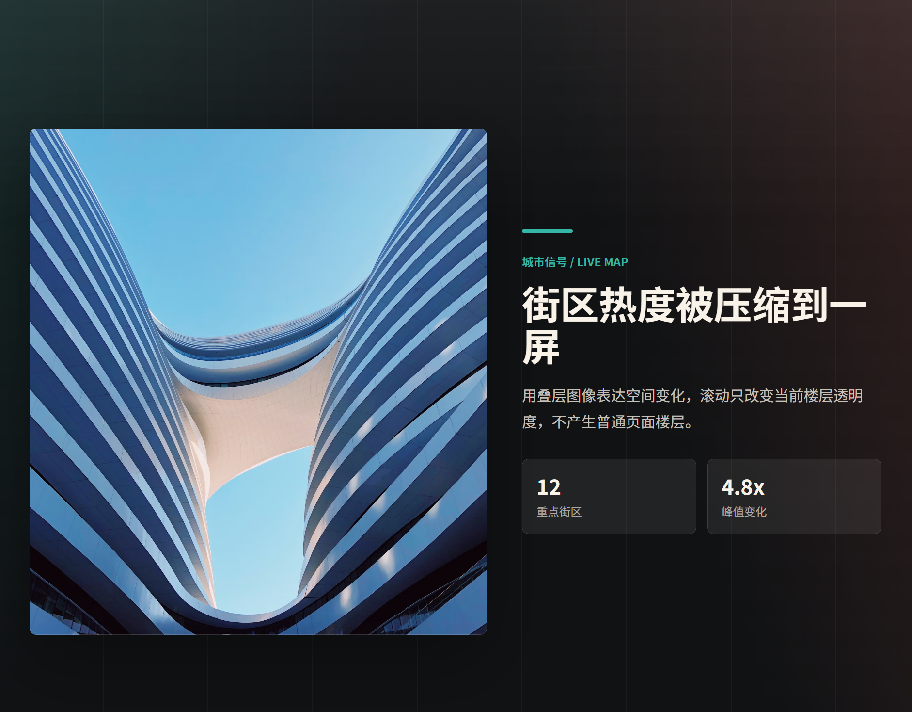

# 用 GSAP 实现 pinned 滚动叙事楼层



这次做的是一个常见的官网叙事动画：页面滚到某一段时，画面固定在一屏里，用户继续滚动，真正变化的不是普通文档流，而是一条由 GSAP 控制的时间线。

当前效果大致是：

1. 三张概览卡片横向排列。
2. 滚动时整条卡片轨道移动，让当前卡片进入屏幕中心。
3. 当前卡片放大，同时透明度降低到 0，把视觉焦点交给详情内容。
4. 当前分组下的多个 section 依次淡入、停留、淡出。
5. section 播放完成后，当前卡片先从放大状态缩回原始尺寸。
6. 最后轨道移动回初始位置，进入下一张卡片的流程。

这里没有使用 ScrollTrigger 的 `pin`，而是让 CSS 的 `position: sticky` 负责固定舞台，ScrollTrigger 只负责把滚动进度映射到 GSAP timeline。

## 页面结构

当前模板可以分成三层：

```text
container
  story-stage       sticky 固定舞台
    story-card      三张概览卡片组成的横向轨道
    story-panel     所有详情 section 的叠放容器
      story-section 每一个详情楼层
```

核心结构如下：

```vue
<div ref="containerRef" class="container" :style="{ '--story-scroll-distance': storyScrollDistance }">
  <div class="story-stage" ref="stageRef">
    <div class="story-card" ref="cardTrackRef">
      <article
        ref="cardRef"
        class="story-item"
        v-for="group in storyGroups"
        :key="group.id"
        :data-card-id="group.id"
      >
        ...
      </article>
    </div>

    <div class="story-panel">
      <section
        ref="panelRef"
        v-for="panel in group.panels"
        class="story-section"
        :data-card-id="group.id"
      >
        ...
      </section>
    </div>
  </div>
</div>
```

`.container` 负责撑开滚动距离，`.story-stage` 固定在视口里，`.story-card` 和 `.story-panel` 都放在这一个固定舞台内。

## 滚动距离

滚动距离来自 `story-data.ts`：

```ts
export const getStoryScrollDistanceVh = (groups: StoryGroup[] = storyGroups) => {
  const panelCount = groups.reduce((total, group) => total + group.panels.length, 0)
  return Math.max((panelCount + groups.length * 1.8) * 100, 720)
}

export const storyScrollDistance = `${getStoryScrollDistanceVh()}vh`
```

页面里把它挂到 CSS 变量：

```vue
:style="{ '--story-scroll-distance': storyScrollDistance }"
```

再用于容器高度：

```less
.container {
  height: calc(100vh + var(--story-scroll-distance, 1440vh));
  min-height: calc(640px + var(--story-scroll-distance, 1440vh));
}
```

这么做的原因是 timeline 里有卡片入场、放大、section 切换、停留、复位等多个片段。如果滚动距离太短，动画会被压得很快，看起来就不丝滑。

## 轨道整体移动

这个版本的要求是移动整条卡片轨道，而不是只移动当前卡片，所以动画目标是 `cardTrack`：

```js
.to(cardTrack, { x: getMoveX(card), duration: 0.85 })
```

`getMoveX` 用来计算轨道需要移动多少，才能让目标卡片居中：

```js
const getMoveX = targetCard => () => {
  const stage = stageRef.value
  const cardTrack = cardTrackRef.value
  if (!stage || !cardTrack) return 0

  const stageRect = stage.getBoundingClientRect()
  const cardRect = targetCard.getBoundingClientRect()
  const currentX = Number(gsap.getProperty(cardTrack, 'x'))
  const stageCenter = stageRect.left + stageRect.width / 2
  const cardCenter = cardRect.left + cardRect.width / 2

  return currentX + stageCenter - cardCenter
}
```

这里把 `currentX` 算进去，是因为轨道可能已经处在某个 transform 状态里。滚动动画支持正向和反向，如果不考虑当前位移，后续卡片居中位置容易偏。

## 卡片放大和淡出

当前卡片进入中心后，会放大到 `scale: 4`，同时透明度变成 0：

```js
.to(card, { opacity: 0, scale: 4, duration: 0.72 }, '<+=0.18')
.to(image, { y: -54, scale: 1.06, duration: 0.72 }, '<')
.to(copy, { y: 58, opacity: 0, duration: 0.58 }, '<')
.to(cardTrack, { autoAlpha: 0, duration: 0.28 }, '<+=0.35')
```

这里单个卡片使用 `opacity`，没有用 `autoAlpha`。原因是 `autoAlpha` 会同时修改 `visibility`，当用户从结尾反向滚回开头时，后面几张卡片可能残留 `visibility: hidden`，导致只剩第一张卡片可见。

`autoAlpha` 更适合用在整条轨道或 section 这种确实需要隐藏的层上。

## section 串行动画

每个卡片分组下面有多个详情 section，它们通过 `addPanelSequence` 依次进入：

```js
const addPanelSequence = (timeline, panels, firstPanelPosition = '>') => {
  if (!panels.length) return

  panels.forEach((panel, index) => {
    const previousPanel = panels[index - 1]
    if (previousPanel) timeline.to(previousPanel, { autoAlpha: 0, duration: 0.45 }, '>')

    timeline
      .to(panel, { autoAlpha: 1, duration: 0.55 }, previousPanel ? '<' : firstPanelPosition)
      .to({}, { duration: 0.75 })
  })

  const lastPanel = panels.at(-1)
  if (lastPanel) {
    timeline.to(lastPanel, { autoAlpha: 0, duration: 0.45 }, '>')
  }
}
```

这里的空 tween：

```js
.to({}, { duration: 0.75 })
```

不改变任何 DOM，只是在时间线上占一段长度。因为 timeline 被 `scrub` 绑定到滚动，所以它对应的就是“继续滚动一段，但画面保持当前 section”的阅读停留时间。

## 卡片恢复顺序

section 播完之后，不能直接把卡片 `set` 回原始状态，否则会少掉恢复动画。当前代码的顺序是：

```js
.to(cardTrack, { autoAlpha: 1, duration: 0.28 }, '>')
.to(card, { opacity: 1, scale: 1, duration: 0.75 }, '<')
.to(image, { y: 0, scale: 1, duration: 0.75 }, '<')
.to(copy, { y: 0, opacity: 1, duration: 0.65 }, '<')
.to(cardTrack, { x: 0, duration: 0.75 }, '>')
.to(otherCards, { opacity: 1, scale: 1, filter: 'saturate(1)', duration: 0.7 }, '<+=0.12')
```

也就是先让当前卡片重新出现并缩回正常大小，再移动整条轨道回到初始位置。这个顺序比“先移动轨道，再恢复卡片”更自然，因为用户能看到当前卡片从详情状态收回到概览状态。

## 视频播放

如果某个 section 里有视频，需要和滚动状态同步。当前代码做了三件事：

1. 找到所有视频和它所在的 `.story-section`。
2. timeline 更新时，判断哪个 section 的透明度超过阈值。
3. 只播放当前可见 section 里的视频，其他视频全部暂停。

核心逻辑：

```js
const syncVideos = () => {
  const visibleVideo =
    videoPanels.find(({ panel }) => Number(gsap.getProperty(panel, 'opacity')) > 0.65)
      ?.video ?? null

  videos.forEach(video => {
    if (video !== visibleVideo) {
      video.pause()
    }
  })

  if (!visibleVideo || activeVideo === visibleVideo) {
    if (!visibleVideo) activeVideo = null
    return
  }

  activeVideo = visibleVideo
  playFromStart(visibleVideo)
}
```

`activeVideo` 的作用是记录当前视频，避免滚动过程中 `onUpdate` 高频触发时，同一个视频不断从头播放。

进入新视频时会从头播放：

```js
const playFromStart = video => {
  try {
    video.currentTime = 0
    video.play().catch(() => undefined)
  } catch {
    video.play().catch(() => undefined)
  }
}
```

`video.play()` 可能会被浏览器策略拒绝，所以这里用了 `catch` 兜底，不让视频播放失败影响主动画。

## ScrollTrigger 初始化

当前时间线写法如下：

```js
const timeline = gsap.timeline({
  defaults: { ease: 'power2.inOut' },
  onUpdate: syncVideos,
  scrollTrigger: {
    trigger: containerRef.value,
    start: 'top top',
    end: 'bottom bottom',
    scrub: 1,
    invalidateOnRefresh: true,
    onLeave: pauseAllVideos,
    onLeaveBack: pauseAllVideos,
  },
})
```

几个关键点：

- `scrub: 1`：滚动进度和动画进度绑定，并带一点缓冲。
- `invalidateOnRefresh: true`：窗口尺寸变化或刷新时重新计算函数型数值，比如 `getMoveX(card)`。
- `onUpdate: syncVideos`：每次时间线更新时同步视频播放状态。
- `onLeave` / `onLeaveBack`：离开动画区域时暂停所有视频。

这里仍然没有使用 `pin`，固定效果由 CSS sticky 完成。

## 清理逻辑

Vue 页面切换时需要清理 GSAP 动画，否则重复进入页面可能会出现多个 ScrollTrigger 同时存在的问题。

当前使用 `gsap.context`：

```js
animationContext = gsap.context(() => {
  // timeline and ScrollTrigger
}, containerRef.value)
```

卸载时：

```js
onBeforeUnmount(() => {
  pauseAllVideos()
  animationContext?.revert()
})
```

`pauseAllVideos()` 负责暂停可能还在播放的视频，`revert()` 负责还原这个 context 中创建的动画和 ScrollTrigger。

## 小结

这版实现的重点不是某一个单独的 GSAP API，而是几件事配合起来：

1. 用 CSS sticky 固定舞台。
2. 用容器高度提供真实滚动距离。
3. 用一个 scrub timeline 编排所有状态。
4. 用整条轨道的 `x` 位移完成卡片居中。
5. 用 `opacity + scale` 做卡片放大淡出，避免单卡片 `autoAlpha` 留下 visibility 状态。
6. 用 `autoAlpha` 控制 section 的叠层显示。
7. 用 timeline 的 `onUpdate` 根据当前可见 section 同步视频播放。

只要保持“轨道移动 -> 卡片放大淡出 -> section 串联 -> 卡片恢复 -> 轨道归位”这个节奏，后面继续增加卡片或增加 section，整体结构也不会乱。
