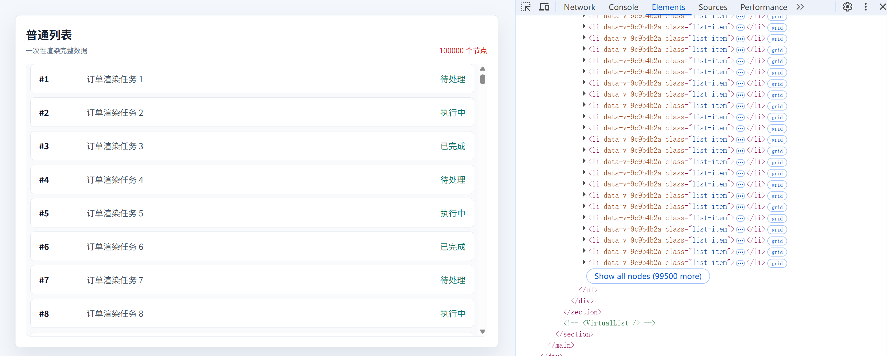
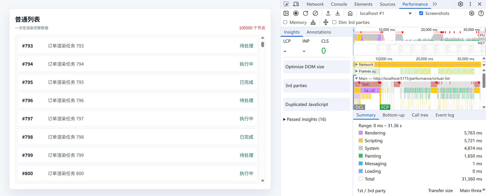
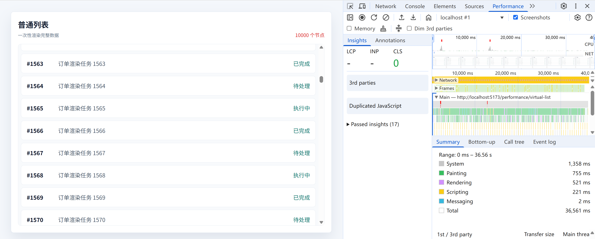
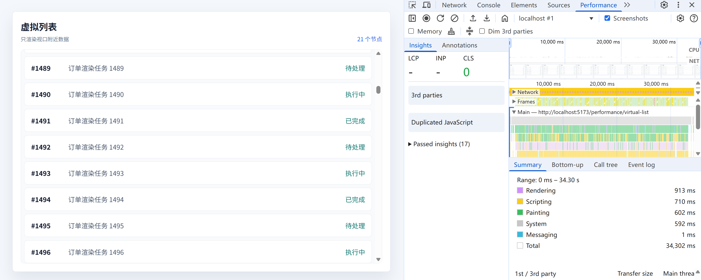

# 虚拟滚动真的比普通滚动性能更好吗？

## 前言

在日常的开发中，列表几乎是最常见的页面形态。

订单列表、日志列表、消息列表、商品列表、审批记录、监控告警，这些页面看起来都很普通，但是为了让页面在操作的流畅，开发者往往在性能方面默默做了很多的优化。

而优化列表性能的方式有很多，比如前端分页、后端分页、虚拟滚动、无限滚动、懒加载、骨架屏、预加载、缓存等等。而今天闪亮登场的主角是 **“虚拟滚动”** 。

众所周知，浏览器在处理列表的时候需要创建 `DOM` 节点，计算样式，布局，绘制等。如果单看列表中的一行结构并不复杂，但是往往导致页面滚动卡顿的就是列表数量的几何增加。而虚拟滚动的出现就是为了解决 `DOM` 的渲染压力。

本文主要会围绕以下几个问题进行展开。

1. 从零实现一个固定高度的虚拟列表。
2. 虚拟滚动是不是一定比普通的滚动性能好？
3. 什么场景下适合使用虚拟滚动？能提升多少性能？

> 如果你对于虚拟滚动的实现已经了然于心，那就直接观看性能对比的部分吧!

## 普通滚动列表实现

在实现虚拟滚动列表之前，让我们假装手搓一个普通的滚动列表吧。



> 温馨提示：以下代码 `vue3` 编写。至于为什么使用 `vue3` 呢？因为我相信光！！！

#### 第一步：`mock` 数据

```js
interface ListItem {
  id: number
  title: string
  status: string
}
const total = 100000
const listData: ListItem[] = Array.from({ length: total }, (_, index) => ({
  id: index + 1,
  title: `订单渲染任务 ${index + 1}`,
  status: index % 3 === 0 ? '待处理' : index % 3 === 1 ? '执行中' : '已完成',
}))
```

先搞十万条数据，测试下要不要换电脑。

#### 第二步：构造 `DOM`

```html
  <section class="list-card">
    <header class="list-header">
      <div>
        <h2>普通列表</h2>
        <p>一次性渲染完整数据</p>
      </div>
      <span>{{ listData.length }} 个节点</span>
    </header>
    <div class="list-view" :style="{ height: `${viewHeight}px` }">
      <ul class="list-body">
        <li v-for="item in listData" :key="item.id" class="list-item">
          <strong>#{{ item.id }}</strong>
          <span>{{ item.title }}</span>
          <em>{{ item.status }}</em>
        </li>
      </ul>
    </div>
  </section>
```

#### 第三步：编写 `CSS`

```css
.list-card {
  border: 1px solid #d8e1ee;
  border-radius: 8px;
  background: #fff;
  padding: 20px;
  box-shadow: 0 18px 40px rgb(33 56 96 / 10%);
}

.list-header {
  display: flex;
  align-items: flex-end;
  justify-content: space-between;
  gap: 16px;
  margin-bottom: 16px;
}

.list-header h2,
.list-header p {
  margin: 0;
}

.list-header h2 {
  font-size: 22px;
  font-weight: 700;
}

.list-header p {
  margin-top: 6px;
  color: #64748b;
  font-size: 13px;
}

.list-header span {
  color: #dc2626;
  font-size: 14px;
}

.list-view {
  overflow: auto;
  border: 1px solid #e2e8f0;
  border-radius: 8px;
  background: #f8fafc;
}

.list-body {
  margin: 0;
  padding: 0 8px;
  list-style: none;
}

.list-item {
  display: grid;
  grid-template-columns: 90px 1fr 82px;
  align-items: center;
  box-sizing: border-box;
  height: 56px;
  margin-bottom: 8px;
  border: 1px solid #e2e8f0;
  border-radius: 8px;
  background: #fff;
  padding: 0 16px;
}

.list-item strong {
  color: #0f172a;
}

.list-item span {
  min-width: 0;
  overflow: hidden;
  color: #475569;
  text-overflow: ellipsis;
  white-space: nowrap;
}

.list-item em {
  justify-self: end;
  color: #0f766e;
  font-style: normal;
}
```

如果你已经看到了这里，同时不会使用 `ai`。那么恭喜你打败了 90% 的非前端人员。

## 虚拟滚动列表实现

虚拟滚动的页面和普通页面的差不多哈，毕竟都是一个 `ai` 写的。


同样有 `100000` 条数据，但是实际渲染的节点只有二十左右。

**这就是虚拟滚动最直观的收益：滚动条看起来像完整列表，但 `DOM` 数量少了很多。**

#### 第一步：构造 `DOM`

这里 `mock` 数据的写法同上哈。

一个最基础的虚拟列表，通常需要三层结构：

```txt
list-view   滚动容器，负责产生 scrollTop
list-space  占位容器，负责撑出完整列表高度
list-body   真实列表，只渲染当前可视区域附近的数据
```

对应代码如下：

```vue
<template>
  <section class="list-card">
    <header class="list-header">
      <div>
        <h2>虚拟列表</h2>
        <p>只渲染视口附近数据</p>
      </div>
      <span>{{ showData.length }} 个节点</span>
    </header>
    <div class="list-view" :style="{ height: `${viewHeight}px` }" @scroll="onScroll">
      <div class="list-space" :style="{ height: `${fullHeight}px` }">
        <ul class="list-body" :style="{ transform: `translateY(${moveY}px)` }">
          <li v-for="item in showData" :key="item.id" class="list-item">
            <strong>#{{ item.id }}</strong>
            <span>{{ item.title }}</span>
            <em>{{ item.status }}</em>
          </li>
        </ul>
      </div>
    </div>
  </section>
</template>
```

这里有两个关键点：

```vue
<div class="list-space" :style="{ height: `${fullHeight}px` }"></div>
```

`list-space` 负责撑开完整高度，让滚动条表现得像真的存在 `10000` 条数据。

而真正渲染的数据来自：

```vue
<li v-for="item in showData" :key="item.id" class="list-item"></li>
```

`showData` 只是完整数据中的一小段切片。

#### 第二步：编写 `CSS`

```css
.list-view {
  height: 520px;
  overflow: auto;
  border: 1px solid #e2e8f0;
  border-radius: 8px;
  background: #f8fafc;
}

.list-space {
  position: relative;
}

.list-body {
  position: absolute;
  top: 0;
  right: 0;
  left: 0;
  margin: 0;
  padding: 8px;
  list-style: none;
  will-change: transform;
}

.list-item {
  display: grid;
  grid-template-columns: 90px 1fr 82px;
  align-items: center;
  box-sizing: border-box;
  height: 56px;
  margin-bottom: 8px;
  border: 1px solid #e2e8f0;
  border-radius: 8px;
  background: #fff;
  padding: 0 16px;
}
```

这里最需要注意的是单行高度。

示例中的每一行真实占用高度是：

```txt
内容高度 56px + margin-bottom 8px = 64px
```

所以脚本中会定义：

```ts
const rowHeight = 64
```

固定高度虚拟列表非常依赖这个值。如果真实行高和 `rowHeight` 不一致，滚动距离越大，位置偏差就会越明显。

#### 第三步：编写 `JS`

1. 监听滚动位置

```ts
const scrollTop = ref(0)
const onScroll = (e: Event) => {
  scrollTop.value = (e.target as HTMLElement).scrollTop
}
```

当用户滚动列表时，我们拿到当前滚动距离，然后根据这个值计算应该渲染哪一段数据。

2. 计算完整高度

```ts
const fullHeight = total * rowHeight
```

`fullHeight` 是完整列表的理论高度。

比如：

```txt
100000 * 64 = 6400000px
```

页面并不会真的渲染 `100000` 个 `DOM`，但是滚动条需要知道完整列表应该有多高。

这就是 `list-space` 的作用：它不负责展示内容，只负责制造完整滚动高度。

3. 计算开始索引 `start`

```ts
const start = computed(() => Math.max(Math.floor(scrollTop.value / rowHeight) - buffer, 0))
```

`start` 表示当前应该从哪个数据索引开始渲染。先不考虑 `buffer`，只看这部分：

```ts
Math.floor(scrollTop.value / rowHeight)
```

假设：

```txt
scrollTop = 640
rowHeight = 64
```

那么：

```txt
640 / 64 = 10
```

说明当前视口顶部大概滚到了索引 `10` 附近。

外层的 `Math.max(..., 0)` 是为了防止结果变成负数。因为刚开始滚动距离是 `0`，如果后面减去 `buffer`，可能会得到负数，所以最小值要限制为 `0`。

4. 计算可视数量 `showCount`

```ts
const showCount = computed(() => Math.ceil(viewHeight / rowHeight))
```

`showCount` 表示视口本身至少需要渲染多少条数据。

当前示例中：

```txt
viewHeight = 520
rowHeight = 64
```

计算结果是：

```txt
520 / 64 = 8.125
```

也就是说，视口里能看到 `8` 条完整数据，还会露出第 `9` 条的一部分。

所以这里使用 `Math.ceil` 向上取整：

```txt
showCount = 9
```

5. 计算结束索引 `end`

```ts
const end = computed(() => Math.min(showCount.value + start.value + buffer * 2, total))
```

`end` 表示当前数据切片结束的位置。

如果没有缓冲区，结束位置大概就是：

```txt
start + showCount
```

但是为了滚动更平滑，我们通常会在可视区域上下多渲染几条数据，所以这里加了：

```txt
buffer * 2
```

`Math.min(..., total)` 是为了避免结束索引超过总数据长度。

6. 截取当前要渲染的数据

```ts
const showData = computed(() => listData.slice(start.value, end.value))
```

`showData` 就是当前真正渲染到页面上的数据。

假设：

```txt
start = 4
end = 25
```

那么真实 `DOM` 中只会渲染：

```txt
索引 4 到索引 24
```

虽然总数据有 `10000` 条，但是此时页面上的 `<li>` 只有二十个左右。

## 虚拟滚动注意事项

1. 为什么需要 `moveY`？

理解虚拟列表时，`moveY` 是最容易卡住的地方。

先看代码：

```ts
const moveY = computed(() => start.value * rowHeight)
```

它对应模板中的：

```vue
<ul class="list-body" :style="{ transform: `translateY(${moveY}px)` }"></ul>
```

它的作用是：把当前渲染出来的这一小段 `DOM`，移动到它在完整列表中应该出现的位置。

为什么要移动？

因为 `slice` 会删除前面的数据。

比如先不考虑 `buffer`，假设：

```txt
scrollTop = 640px
rowHeight = 64px
start = 10
```

此时索引 `10` 这条数据在完整列表中的真实位置应该是：

```txt
10 * 64 = 640px
```

但是执行：

```ts
listData.slice(10, end)
```

以后，索引 `10` 这条数据会变成 `showData` 的第一条。

如果没有 `moveY`，这条数据会从 `list-body` 的顶部开始渲染，也就是 `0px` 的位置。

这就出现了错位：

```txt
数据已经是索引 10
位置却还是索引 0 的位置
```

所以需要：

```txt
moveY = start * rowHeight
```

把这段 `DOM` 往下移动 `640px`。

图示如下：


一句话总结：

> **`slice` 负责减少 `DOM` 数量，`moveY` 负责补回被 `slice` 掉的空间位置。**

如果没有 `moveY`，滚动过程中会出现内容错位、空白甚至抖动。根本原因不是 `DOM` 更新频繁，而是更新后的 `DOM` 没有站回完整列表中正确的高度位置。

2. `buffer` 的作用？

`buffer` 是缓冲区。

```ts
const buffer = 6
```

它的作用是：在视口上方和下方额外多渲染几条数据，避免快速滚动时出现短暂空白。

假设当前视口顶部已经滚到索引 `10` 附近。

如果没有缓冲区：

```txt
start = 10
```

也就是刚好从索引 `10` 开始渲染。

如果设置：

```txt
buffer = 6
```

那么：

```txt
start = 10 - 6 = 4
```

也就是说，虽然用户当前真正看到的是索引 `10` 附近，但 `DOM` 会提前从索引 `4` 开始渲染。

再结合：

```ts
const end = computed(() => Math.min(showCount.value + start.value + buffer * 2, total))
```

假设：

```txt
showCount = 9
start = 4
buffer = 6
```

那么：

```txt
end = 4 + 9 + 12 = 25
```

实际渲染范围是：

```txt
索引 4 到索引 24
```

可以理解成：

```txt
索引 4 - 9：视口上方缓冲
索引 10 - 18：当前可见区域
索引 19 - 24：视口下方缓冲
```

这样做的好处是滚动更平滑，尤其是在滚动速度比较快、列表项内容比较复杂的时候，用户不容易看到空白区域。

不过 `buffer` 也不是越大越好。它越大，额外渲染的 `DOM` 越多；它越小，快速滚动时越容易露白。实际项目中可以根据列表复杂度和设备性能做调整。

## 完整代码

## 性能对比

两者都选择清空缓存重新加载的情况下录制30秒左右。

### 十万条数据普通滚动 `Performance`



1. `Rendering`（渲染计算时间）: `5763ms`
2. `Scripting`（`JS` 执行时间）: `5721ms`
3. `System`（系统层面杂项开销时间）: `4874ms`
4. `Painting`（绘制时间）: `1650ms`

### 十万条数据虚拟滚动 `Performance`


1. `Rendering`（渲染计算时间）: `710ms`
2. `Scripting`（`JS` 执行时间）: `592ms`
3. `System`（系统层面杂项开销时间）: `757ms`
4. `Painting`（绘制时间）: `449ms`

**核心结论：**

1. 普通列表的问题主要在于：它一次性把 100000 行都渲染出来。每一行又存在多个节点，实际会产生几十万个 `DOM` 相关节点。浏览器要创建 `DOM`、计算样式、布局、绘制，压力会非常大，所有在加载和滚动的过程中有明显的卡顿。
2. 虚拟列表虽然滚动时会不断更新 `DOM`，但它始终只保留大概二十几个节点，所以它的初始渲染快很多，内存压力小很多，列表在滚动的过程中很稳定。

#### 🤔可能存在的疑问？

1. 在普通滚动的代码中 `js` 代码只有 `mock` 数据部分，为什么 `Scripting` 的时间还是比虚拟滚动的长呢？

**回答：**有这样的疑问，大概率是忽略了 `Vue` 模板最终会变成 `JS` 渲染函数，也就是说 `<li v-for="item in listData" :key="item.id">`会变成 ` listData.map(item => createVNode('li', ...))`。这里的创建 100000 个 `vnode`、对 100000 个 `vnode` 做 `patch`、调用 `DOM API` 创建真实节点、设置 `class` / `text` / 属性、插入页面的部分都属于 `Scripting`。

对比完十万条数据，如果将数据压缩到一万条会怎么样呢？这次同样两者都选择下30多秒的录制。

### 一万条数据普通滚动 `Performance`



1. `Rendering`（渲染计算时间）: `521ms`
2. `Scripting`（`JS` 执行时间）: `221ms`
3. `System`（系统层面杂项开销时间）: `1358ms`
4. `Painting`（绘制时间）: `755ms`

### 一万条数据虚拟滚动 `Performance`



1. `Rendering`（渲染计算时间）: `913ms`
2. `Scripting`（`JS` 执行时间）: `710ms`
3. `System`（系统层面杂项开销时间）: `592ms`
4. `Painting`（绘制时间）: `602ms`

**核心结论：**

1. 两者在滚动的过程中都比较流程，没有出现卡顿现象。
2. 从上面的数据可以看出虚拟列表 `Scripting` 更高，这是由于虚拟列表滚动时需要不断计算 `start` / `end` / `showData` / `moveY`，并更新可见 `DOM`，所以 `JS` 和局部渲染成本会更高。

## 适用场景

**虚拟滚动的场景：**

1. 数据量很大，比如 5 万、10 万、几十万条(同时配合后端分页)
2. 每一行 `DOM` 结构复杂，比如有图片、按钮、标签、组件、图标
3. 设备性能弱，内存紧张
4. 列表项高度固定，或者高度可预测

**普通滚动的场景：**

1. 只有几百条、几千条简单数据
2. 用户不会深度滚动
3. 每一行高度变化很大，而且很难提前计算
4. 列表项内部有复杂状态，`DOM` 复用容易带来状态串行

**至于“能提升多少性能”，不能给固定值，要看数据量和行复杂度。你这两组测试大概可以这样总结：**

两者在一万条简单数据的时候，双方各有优劣，整体都能撑住。虚拟列表不一定在所有 `Performance` 指标上都赢，如果数据量进一步减少，则普通列表的优势会更加明显。抛开电脑配置，框架本身等因素，可以简单得出一万条简单数据是两者的分水岭，但是虚拟列表的上限很高，下限可能略低普通滚动。

## 补充说明

真实业务里，如果数据量非常大，虚拟滚动通常还会配合后端分页或者滚动加载使用。前端虚拟滚动负责减少 `DOM`，后端分页负责减少一次性传输和内存压力。

**最后再抛出一个问题，如果行的高度不是固定的，且高度变化比较大，同时数据量也很大，如何使用虚拟滚动实现呢？**

如果这篇文章对你有帮助，欢迎点赞、收藏，也欢迎在评论区交流你的想法。

我是 **`Mh`**，一个持续学习前端、喜欢把问题拆开讲清楚的开发者。
