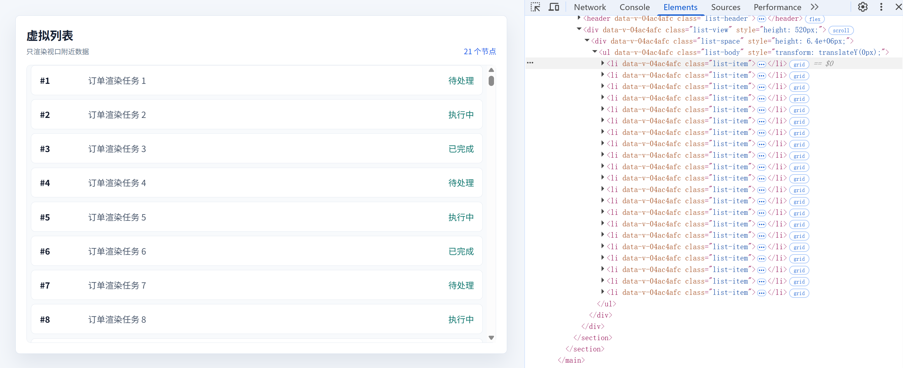
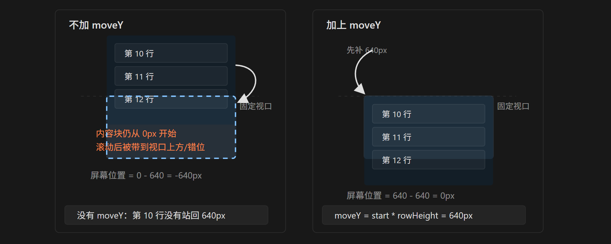

# 使用虚拟滚动究竟能提升页面多少性能？

## 前言

在前端开发中，列表几乎是最常见的页面形态。

订单列表、日志列表、消息列表、商品列表、审批记录、监控告警，这些页面看起来都很普通，但只要数据量一上来，性能问题就会变得非常明显。

比如一次性渲染 `10000` 条数据，浏览器需要创建大量 DOM 节点，还要计算样式、布局、绘制页面。即使每一行的结构并不复杂，数量堆上去以后，页面滚动、更新、交互都会变慢。

虚拟滚动就是为了解决这个问题而出现的。

不过有一点需要先说清楚：虚拟滚动解决的不是接口数据量问题，而是 DOM 渲染压力。

也就是说，虚拟滚动的核心思想是：

> 数据可以很多，但页面上真实存在的 DOM 节点只保留当前视口附近的一小段。

这篇文章会从零实现一个固定高度的虚拟列表，并重点解释两个容易卡住的点：`moveY` 和 `buffer`。

## 最终效果

先看一下最终页面效果：



页面中一共有 `10000` 条数据，但是实际渲染的节点只有二十个左右。

这就是虚拟滚动最直观的收益：滚动条看起来像完整列表，但 DOM 数量始终很少。

## 虚拟列表的核心结构

一个最基础的虚拟列表，通常需要三层结构：

```txt
list-view   滚动容器，负责产生 scrollTop
list-space  占位容器，负责撑出完整列表高度
list-body   真实列表，只渲染当前可视区域附近的数据
```

对应代码如下：

```vue
<template>
  <main class="list-page">
    <section class="list-shell">
      <header class="list-header">
        <h1>虚拟列表</h1>
        <span>{{ total }} 条数据，仅渲染 {{ showData.length }} 个节点</span>
      </header>

      <div class="list-view" @scroll="onScroll">
        <div class="list-space" :style="{ height: `${fullHeight}px` }">
          <ul class="list-body" :style="{ transform: `translateY(${moveY}px)` }">
            <li v-for="item in showData" :key="item.id" class="list-item">
              <strong>#{{ item.id }}</strong>
              <span>{{ item.title }}</span>
              <em>{{ item.status }}</em>
            </li>
          </ul>
        </div>
      </div>
    </section>
  </main>
</template>
```

这里有两个关键点：

```vue
<div class="list-space" :style="{ height: `${fullHeight}px` }">
```

`list-space` 负责撑开完整高度，让滚动条表现得像真的存在 `10000` 条数据。

而真正渲染的数据来自：

```vue
<li v-for="item in showData" :key="item.id" class="list-item">
```

`showData` 只是完整数据中的一小段切片。

## 样式部分

核心样式如下：

```less
.list-view {
  height: 520px;
  overflow: auto;
  border: 1px solid #e2e8f0;
  border-radius: 8px;
  background: #f8fafc;
}

.list-space {
  position: relative;
}

.list-body {
  position: absolute;
  top: 0;
  right: 0;
  left: 0;
  margin: 0;
  padding: 8px;
  list-style: none;
  will-change: transform;
}

.list-item {
  display: grid;
  grid-template-columns: 90px 1fr 82px;
  align-items: center;
  box-sizing: border-box;
  height: 56px;
  margin-bottom: 8px;
  border: 1px solid #e2e8f0;
  border-radius: 8px;
  background: #fff;
  padding: 0 16px;
}
```

这里最需要注意的是单行高度。

示例中的每一行真实占用高度是：

```txt
内容高度 56px + margin-bottom 8px = 64px
```

所以脚本中会定义：

```ts
const rowHeight = 64
```

固定高度虚拟列表非常依赖这个值。如果真实行高和 `rowHeight` 不一致，滚动距离越大，位置偏差就会越明显。

## 准备数据

先模拟 `10000` 条数据：

```ts
const total = 10000

const listData = Array.from({ length: total }, (_, index) => ({
  id: index + 1,
  title: `订单渲染任务 ${index + 1}`,
  status: index % 3 === 0 ? '待处理' : index % 3 === 1 ? '执行中' : '已完成',
}))
```

真实业务里，这里可以替换成接口数据。

如果数据量非常大，虚拟滚动通常还会配合后端分页或者滚动加载使用。前端虚拟滚动负责减少 DOM，后端分页负责减少一次性传输和内存压力。

## 监听滚动位置

虚拟列表的计算都依赖 `scrollTop`。

```ts
const scrollTop = ref(0)

const onScroll = (e: Event) => {
  scrollTop.value = (e.target as HTMLElement).scrollTop
}
```

当用户滚动列表时，我们拿到当前滚动距离，然后根据这个值计算应该渲染哪一段数据。

## 计算完整高度

```ts
const fullHeight = total * rowHeight
```

`fullHeight` 是完整列表的理论高度。

比如：

```txt
10000 * 64 = 640000px
```

页面并不会真的渲染 `10000` 个 DOM，但是滚动条需要知道完整列表应该有多高。

这就是 `list-space` 的作用：它不负责展示内容，只负责制造完整滚动高度。

## 计算开始索引 start

```ts
const start = computed(() => Math.max(Math.floor(scrollTop.value / rowHeight) - buffer, 0))
```

`start` 表示当前应该从哪个数据索引开始渲染。

先不考虑 `buffer`，只看这部分：

```ts
Math.floor(scrollTop.value / rowHeight)
```

假设：

```txt
scrollTop = 640
rowHeight = 64
```

那么：

```txt
640 / 64 = 10
```

说明当前视口顶部大概滚到了索引 `10` 附近。

外层的 `Math.max(..., 0)` 是为了防止结果变成负数。因为刚开始滚动距离是 `0`，如果后面减去 `buffer`，可能会得到负数，所以最小值要限制为 `0`。

## 计算可视数量 showCount

```ts
const showCount = computed(() => Math.ceil(viewHeight / rowHeight))
```

`showCount` 表示视口本身至少需要渲染多少条数据。

当前示例中：

```txt
viewHeight = 520
rowHeight = 64
```

计算结果是：

```txt
520 / 64 = 8.125
```

也就是说，视口里能看到 `8` 条完整数据，还会露出第 `9` 条的一部分。

所以这里使用 `Math.ceil` 向上取整：

```txt
showCount = 9
```

## 计算结束索引 end

```ts
const end = computed(() => Math.min(showCount.value + start.value + buffer * 2, total))
```

`end` 表示当前数据切片结束的位置。

如果没有缓冲区，结束位置大概就是：

```txt
start + showCount
```

但是为了滚动更平滑，我们通常会在可视区域上下多渲染几条数据，所以这里加了：

```txt
buffer * 2
```

`Math.min(..., total)` 是为了避免结束索引超过总数据长度。

## 截取当前要渲染的数据

```ts
const showData = computed(() => listData.slice(start.value, end.value))
```

`showData` 就是当前真正渲染到页面上的数据。

假设：

```txt
start = 4
end = 25
```

那么真实 DOM 中只会渲染：

```txt
索引 4 到索引 24
```

虽然总数据有 `10000` 条，但是此时页面上的 `<li>` 只有二十个左右。

## 为什么需要 moveY？

理解虚拟列表时，`moveY` 是最容易卡住的地方。

先看代码：

```ts
const moveY = computed(() => start.value * rowHeight)
```

它对应模板中的：

```vue
<ul class="list-body" :style="{ transform: `translateY(${moveY}px)` }">
```

它的作用是：把当前渲染出来的这一小段 DOM，移动到它在完整列表中应该出现的位置。

为什么要移动？

因为 `slice` 会删除前面的数据。

比如先不考虑 `buffer`，假设：

```txt
scrollTop = 640px
rowHeight = 64px
start = 10
```

此时索引 `10` 这条数据在完整列表中的真实位置应该是：

```txt
10 * 64 = 640px
```

但是执行：

```ts
listData.slice(10, end)
```

以后，索引 `10` 这条数据会变成 `showData` 的第一条。

如果没有 `moveY`，这条数据会从 `list-body` 的顶部开始渲染，也就是 `0px` 的位置。

这就出现了错位：

```txt
数据已经是索引 10
位置却还是索引 0 的位置
```

所以需要：

```txt
moveY = start * rowHeight
```

把这段 DOM 往下移动 `640px`。

图示如下：



一句话总结：

> `slice` 负责减少 DOM 数量，`moveY` 负责补回被 `slice` 掉的空间位置。

如果没有 `moveY`，滚动过程中会出现内容错位、空白甚至抖动。根本原因不是 DOM 更新频繁，而是更新后的 DOM 没有站回完整列表中正确的高度位置。

## buffer 的作用

`buffer` 是缓冲区。

```ts
const buffer = 6
```

它的作用是：在视口上方和下方额外多渲染几条数据，避免快速滚动时出现短暂空白。

假设当前视口顶部已经滚到索引 `10` 附近。

如果没有缓冲区：

```txt
start = 10
```

也就是刚好从索引 `10` 开始渲染。

如果设置：

```txt
buffer = 6
```

那么：

```txt
start = 10 - 6 = 4
```

也就是说，虽然用户当前真正看到的是索引 `10` 附近，但 DOM 会提前从索引 `4` 开始渲染。

再结合：

```ts
const end = computed(() => Math.min(showCount.value + start.value + buffer * 2, total))
```

假设：

```txt
showCount = 9
start = 4
buffer = 6
```

那么：

```txt
end = 4 + 9 + 12 = 25
```

实际渲染范围是：

```txt
索引 4 到索引 24
```

可以理解成：

```txt
索引 4 - 9：视口上方缓冲
索引 10 - 18：当前可见区域
索引 19 - 24：视口下方缓冲
```

这样做的好处是滚动更平滑，尤其是在滚动速度比较快、列表项内容比较复杂的时候，用户不容易看到空白区域。

不过 `buffer` 也不是越大越好。它越大，额外渲染的 DOM 越多；它越小，快速滚动时越容易露白。实际项目中可以根据列表复杂度和设备性能做调整。

## 完整代码

最后放一下完整代码：

```vue
<template>
  <main class="list-page">
    <section class="list-shell">
      <header class="list-header">
        <h1>虚拟列表</h1>
        <span>{{ total }} 条数据，仅渲染 {{ showData.length }} 个节点</span>
      </header>
      <div class="list-view" @scroll="onScroll">
        <div class="list-space" :style="{ height: `${fullHeight}px` }">
          <ul class="list-body" :style="{ transform: `translateY(${moveY}px)` }">
            <li v-for="item in showData" :key="item.id" class="list-item">
              <strong>#{{ item.id }}</strong>
              <span>{{ item.title }}</span>
              <em>{{ item.status }}</em>
            </li>
          </ul>
        </div>
      </div>
    </section>
  </main>
</template>

<script lang="ts" setup>
import { computed, ref } from 'vue'

const total = 10000
const rowHeight = 64
const viewHeight = 520
const buffer = 6
const scrollTop = ref(0)

const listData = Array.from({ length: total }, (_, index) => ({
  id: index + 1,
  title: `订单渲染任务 ${index + 1}`,
  status: index % 3 === 0 ? '待处理' : index % 3 === 1 ? '执行中' : '已完成',
}))

const fullHeight = total * rowHeight
const start = computed(() => Math.max(Math.floor(scrollTop.value / rowHeight) - buffer, 0))
const showCount = computed(() => Math.ceil(viewHeight / rowHeight))
const end = computed(() => Math.min(showCount.value + start.value + buffer * 2, total))
const showData = computed(() => listData.slice(start.value, end.value))
const moveY = computed(() => start.value * rowHeight)

const onScroll = (e: Event) => {
  scrollTop.value = (e.target as HTMLElement).scrollTop
}
</script>

<style lang="less" scoped>
.list-page {
  padding: 32px;
  background: #f4f7fb;
  color: #172033;
}

.list-shell {
  max-width: 980px;
  margin: 0 auto;
  border: 1px solid #d8e1ee;
  border-radius: 8px;
  background: #fff;
  padding: 24px;
  box-shadow: 0 18px 40px rgb(33 56 96 / 10%);
}

.list-header {
  display: flex;
  align-items: flex-end;
  justify-content: space-between;
  gap: 16px;
  margin-bottom: 20px;
}

.list-header h1 {
  margin: 0;
  font-size: 26px;
  font-weight: 700;
}

.list-header span {
  color: #2563eb;
  font-size: 14px;
}

.list-view {
  height: 520px;
  overflow: auto;
  border: 1px solid #e2e8f0;
  border-radius: 8px;
  background: #f8fafc;
}

.list-space {
  position: relative;
}

.list-body {
  position: absolute;
  top: 0;
  right: 0;
  left: 0;
  margin: 0;
  padding: 8px;
  list-style: none;
  will-change: transform;
}

.list-item {
  display: grid;
  grid-template-columns: 90px 1fr 82px;
  align-items: center;
  box-sizing: border-box;
  height: 56px;
  margin-bottom: 8px;
  border: 1px solid #e2e8f0;
  border-radius: 8px;
  background: #fff;
  padding: 0 16px;
}

.list-item strong {
  color: #0f172a;
}

.list-item span {
  min-width: 0;
  overflow: hidden;
  color: #475569;
  text-overflow: ellipsis;
  white-space: nowrap;
}

.list-item em {
  justify-self: end;
  color: #0f766e;
  font-style: normal;
}
</style>
```

## 结束语

虚拟滚动并不会让接口返回的数据变少，它真正优化的是页面上的 DOM 数量。

这套实现里，`fullHeight` 负责保留完整滚动体验，`showData` 负责控制真实渲染范围，`moveY` 负责修正渲染片段的位置，`buffer` 负责让滚动更平滑。

对于固定高度列表来说，理解这几个变量之后，虚拟滚动的原理就很清晰了。后续如果要处理动态高度、图片加载、列表项展开、后端分页等复杂场景，也是在这个基础上继续扩展。
